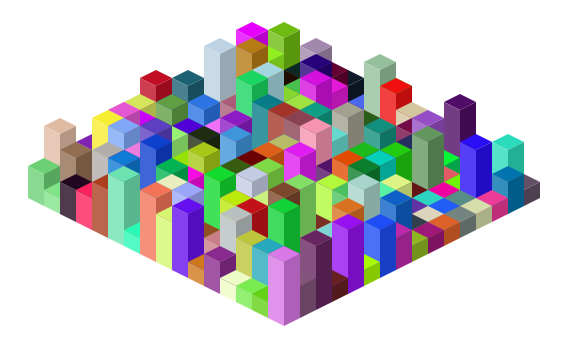

Instructions
===

live reload
`npm start`
`firefox ./dist/index.html`

build
`npm run build`

Status Preview
===

Learn
===

- webpack setup
- isometric math
- [pSBC][1]

[1]: https://github.com/PimpTrizkit/PJs/wiki/12.-Shade,-Blend-and-Convert-a-Web-Color-(pSBC.js)